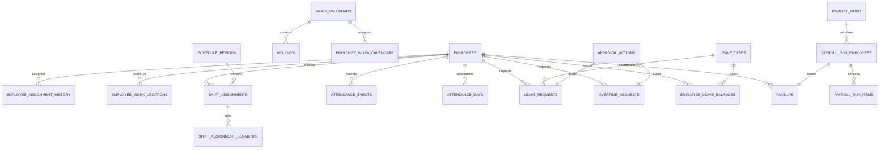

# HR Operations ERD (pre-migration)

The authoritative proposed columns, keys, and indexes remain in `prisma/migrations/0002_hr_operations_suite/migration.sql`; this diagram deliberately summarizes relationships only.
