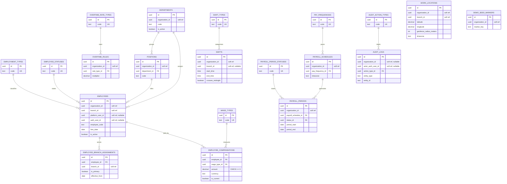

# Phase 8B — HR Schema Review

**Status: WAITING APPROVAL — NOT APPLIED.**
`prisma/migrations/0001_hr_core/migration.sql` is a preview artefact. Do not run
`prisma migrate deploy`, `prisma db push`, or `prisma migrate reset` against any
environment until product owners sign off on this document.

| Item | Value |
| --- | --- |
| Schema | `hr` (only) |
| Migration | `0001_hr_core` |
| Tables | 20 (8 master + 12 operational) |
| PostgreSQL enums | none — master tables with immutable `code` |
| Cross-schema foreign keys | none |

## ERD



## Master data

Every master table carries `id`, unique `code`, `name_th`, `name_en`,
`description`, `sort_order`, `is_active`, `is_system`, `created_at`, `updated_at`.
Codes are immutable; renaming a concept means adding a new code, never editing one.

| Table | Seeded codes |
| --- | --- |
| `employment_types` | `DAILY`, `MONTHLY`, `CONTRACT`, `TEMPORARY` |
| `employee_statuses` | `ACTIVE`, `INACTIVE`, `RESIGNED`, `TERMINATED`, `SUSPENDED` |
| `shift_types` | `REGULAR`, `NIGHT`, `SPLIT`, `OFF`, `LEAVE` |
| `pay_frequencies` | `SEMIMONTHLY`, `MONTHLY`, `WEEKLY`, `DAILY` |
| `wage_types` | `DAILY`, `MONTHLY`, `HOURLY` |
| `overtime_rate_types` | `NORMAL_DAY`, `HOLIDAY`, `REST_DAY`, `SPECIAL` |
| `payroll_period_statuses` | `DRAFT`, `OPEN`, `CALCULATING`, `REVIEW`, `APPROVED`, `PAID`, `LOCKED` |
| `audit_action_types` | 19 codes, listed below |

Audit vocabulary: `employee.create`, `employee.update`, `employee.deactivate`,
`employee.link_user`, `employee.unlink_user`, `compensation.add`,
`department.create`, `department.update`, `department.deactivate`,
`position.create`, `position.update`, `position.deactivate`, `shift.create`,
`shift.update`, `shift.deactivate`, `payroll_schedule.create`,
`payroll_schedule.update`, `payroll_period.create`,
`payroll_period.status_change`.

All master seeds use `INSERT ... ON CONFLICT ("code") DO NOTHING`, so re-running
the migration or `npm run seed:hr` never duplicates or rewrites a code.

## Unique constraints

| Table | Unique key | Rationale |
| --- | --- | --- |
| every master table | `code` | stable machine identifier |
| `departments` | `(organization_id, code)` | codes are tenant-scoped |
| `positions` | `(organization_id, code)` | codes are tenant-scoped |
| `work_locations` | `(organization_id, code)` | codes are tenant-scoped |
| `employees` | `(organization_id, employee_code)` | HR-visible employee number |
| `employees` | `(organization_id, platform_user_id)` | one employee per Platform user per tenant |
| `employees` | `(organization_id, auth_user_id)` | one employee per Auth user per tenant |
| `employee_branch_assignments` | `(employee_id, branch_id, effective_from)` | no duplicate assignment rows |
| `overtime_rules` | `(organization_id, code)` | codes are tenant-scoped |
| `shifts` | `(organization_id, code)` | codes are tenant-scoped |
| `payroll_schedules` | `(organization_id, code)` | codes are tenant-scoped |
| `payroll_periods` | `(organization_id, payroll_schedule_id, period_start, period_end)` | one period per schedule window |
| `demo_seed_markers` | `(organization_id, marker_key)` | idempotent demo cleanup |

The two "linked user" unique keys rely on PostgreSQL treating NULLs as distinct,
so any number of employees may stay unlinked while a linked user can appear only
once per organization. This is the intended replacement for a partial unique index.

## Indexes

| Table | Index |
| --- | --- |
| `departments`, `positions`, `work_locations`, `overtime_rules`, `shifts`, `payroll_schedules` | `(organization_id, is_active)` |
| `positions` | `(department_id)` |
| `work_locations`, `shifts`, `employee_branch_assignments` | `(branch_id)` |
| `employees` | `(organization_id)`, `(branch_id)`, `(employee_status_id)`, `(organization_id, is_active)`, `(department_id)`, `(position_id)` |
| `employee_branch_assignments` | `(employee_id, is_primary)` |
| `employee_compensations` | `(employee_id)`, `(employee_id, is_current)`, `(wage_type_id)` |
| `overtime_rules` | `(rate_type_id)` |
| `shifts` | `(shift_type_id)` |
| `payroll_schedules` | `(pay_frequency_id)` |
| `payroll_periods` | `(organization_id, status_id)`, `(payroll_schedule_id)`, `(organization_id, period_start)` |
| `audit_logs` | `(organization_id, created_at)`, `(entity_type, entity_id)`, `(actor_auth_user_id)`, `(action_type_id)` |
| `demo_seed_markers` | `(organization_id)` |

Every tenant-facing index leads with `organization_id` so filtered reads stay on
one tenant's slice of the table.

## CHECK constraints

| Constraint | Rule |
| --- | --- |
| `employee_compensations_amount_non_negative` | `amount >= 0` |
| `work_locations_geofence_radius_positive` | `geofence_radius_meters > 0` |

These are database-level guards that Prisma cannot express in the model, so the
application layer validates the same rules before writing. They will show as
"extra" if someone later runs `prisma migrate dev`; keep them.

## Tenant isolation

- `organization_id` and `branch_id` are UUID columns with **no** foreign key to
  the `platform` schema. HR and Platform can be migrated, backed up, and restored
  independently, and HR never takes a lock on Platform tables.
- `platform_user_id` and `auth_user_id` are likewise soft references. Linking an
  employee to a login is an HR-side write only; nothing in `auth` changes.
- Every tenant-scoped table stores `organization_id` directly instead of relying
  on a join, so the application can add an `organization_id` predicate to every
  query and, later, a row-level security policy without schema changes.
- Referential integrity **inside** `hr` is enforced with real foreign keys:
  masters use `ON DELETE RESTRICT`, employee children use `ON DELETE CASCADE`,
  and optional org structure links use `ON DELETE SET NULL`.
- Uniqueness is never global for tenant data. Codes are unique per organization,
  so two tenants may both own a department called `HR01`.

## Data retention

- `employees` are deactivated (`is_active = false` plus a terminal
  `employee_status`), never deleted. `resignation_date` records the end of
  employment while the payroll history stays intact.
- `employee_compensations` is append-only wage history. Superseding a wage means
  writing a new row and clearing `is_current` on the old one; `effective_from` /
  `effective_to` preserve the timeline for back-pay recalculation.
- `payroll_periods` become immutable once `locked_at` is set; corrections belong
  in a new period rather than an edit.
- `audit_logs` keeps `before_json` / `after_json` snapshots. Thai labour law
  requires payroll records to be retained for at least 2 years after payment
  (5 years is the common internal standard), so no automated purge is defined in
  this phase. An archival job is a Phase 8D decision.
- `demo_seed_markers` exists only so development demo data can be removed
  exactly. Demo rows also carry a `DEMO_` code prefix and are never written in
  production (`SEED_MODE=development-demo` is blocked there).

## Phase 8C design note — daily shift schedules (ตารางกะรายวัน)

**Not implemented in Phase 8B.** `shifts` currently stores shift *templates*
(start/end time, break, grace windows, midnight crossing, standard minutes).
There is no per-day roster yet.

The planned Phase 8C shape, for review only:

- `employee_shift_schedules` — one row per employee per work date:
  `organization_id`, `branch_id`, `employee_id`, `shift_id`, `work_date` (Date),
  `work_location_id?`, `schedule_status_id`, `notes?`, with
  `@@unique([employeeId, workDate])` and an index on
  `(organization_id, work_date)`.
- `shift_schedule_statuses` — new master table (`PLANNED`, `PUBLISHED`,
  `SWAPPED`, `CANCELLED`) rather than an enum.
- `attendance_records` — clock in/out events referencing the schedule row and a
  `work_location_id`, validated against the geofence already stored on
  `work_locations`.

Because 8B keeps `shifts` as templates only, 8C can be a purely additive
migration: new tables plus new master rows, no change to existing columns.

## Migration safety review checklist

Automated by `npm run db:migration:check` (see `src/lib/db/migration-safety.ts`):

- [x] Creates `CREATE SCHEMA IF NOT EXISTS "hr"`.
- [x] Every schema-qualified identifier in the file is `"hr"` — no `platform`,
      `auth`, `public`, `resident_v2`, or `qrstation`.
- [x] Every `CREATE TABLE` / `CREATE INDEX` / `ALTER TABLE` / `INSERT INTO`
      statement is explicitly qualified with `"hr"`.
- [x] No `CREATE TYPE` and no `AS ENUM`.
- [x] No `DROP TABLE`, `DROP COLUMN`, `DROP SCHEMA`, or `TRUNCATE`.
- [x] All eight master tables are present.
- [x] Master seeds are `ON CONFLICT DO NOTHING`, so the file is re-runnable.

Reviewed manually:

- [x] Foreign keys stay inside `hr`; soft UUID columns carry no FK.
- [x] `id` columns are UUID; the application (or `gen_random_uuid()` in seeds)
      supplies values, matching Prisma's `@default(uuid())`.
- [x] Timestamps are `TIMESTAMPTZ(6)`; dates that must not shift with timezone
      (`hire_date`, `period_start`, …) are `DATE`.
- [x] Money is `DECIMAL(14,2)`, never a float.
- [x] The header states preview-only status.
- [x] No secrets, connection strings, or tenant data appear in the SQL.

## How to review before approving

```bash
npm run db:validate          # Prisma schema parses
npm run db:generate          # client generates from the schema
npm run db:migration:check   # static SQL safety gate
npm run db:preflight         # read-only connection report, never applies anything
npm test                     # schema + migration guard tests
```

`db:preflight` reports whether schema `hr` exists and whether `0001_hr_core` has
been recorded in `_prisma_migrations`. `db:verify` reports `SKIPPED` until the
migration is applied, so both are safe to run today.

Applying the migration remains a separate, explicitly approved step.
